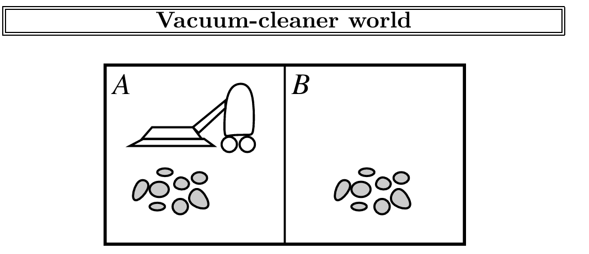

# Notas de la Semana de IA 
>   Semana del 13 de Enero al 17 de Enero 

### **¿Que es la Inteligencia Artificial?** 
Es el desarrollo de *agentes*  que al interactuar
con un entorno (y posiblemente otros agentes) maximice
la esperanza de una utilidad futura

Segun [Wikipedia](https://es.wikipedia.org/wiki/Inteligencia_artificial) la inteligencia artificial 
es una disciplina y un conjunto de capacidades cognoscitivas 
e intelectuales expresadas por algoritmos cuyo proposito es 
la creacion de maquinas que imiten la inteligencia humana 

### **Tipos de IA** 
- **Sistemas que piensan como Humanos**: Estos sistemas tratan 
de emular el pensamiento humano, como la automatización 
de actividades que vinculamos con procesos de pensamiento
humano, como por ejemplo la toma de decisiones,resolucion de problemas y aprendizaje

- **Sistemas que actuan como humanos** :Estos sistemas tratan 
de actuar como humanos, por ejemplo la robotica 

- **Sistemas que piensan racionalmente**: Estos sistemas piensan 
con logica, tratan de imitar el pensamiento racional del ser humano
- **Sistemas que actuan racionalmente**: Estos sistemas tratan de
emular de forma racional el comportamiento humano

### **Interactuar Racionalmente**
Maximizar la utilidad esperada con las mediciones disponibles 
con las acciones disponibles, con lo que se conoce del entorno 

> **Racional no significa exitoso ni perfecto**

### Lo que debe saber el agente del entorno
- Medida de desempeño/utilidad (Tarea/Medida de desempeño)
- Caracteristicas del entorno (entorno)
- Actuadores (Acciones)
- Sensores (Percepciones)

> **M E A S**

### Caracteristicas del entorno 
- Discreto / Continuo
- Estatico / Dinamico 
- Observable / Parcialmente observable 
- Determinista / Estocastico
- Conocido / Desconocido 
- Un agente / Multiagente 
- Episodico / Secuencial
### Espacios de estado 

Es la multiplicacion cartesiana de todos los estados 
*X* = *X1* x *X2* x ...*Xn* 
Dicho de otra forma un espacio de estado es un vector

### Ejemplo

En el entorno de la aspiradora
las percepciones: locación y situacion 
por ejemplo [A,sucio] 
las acciones: {ir A, ir B, Limpiar, Nada}

