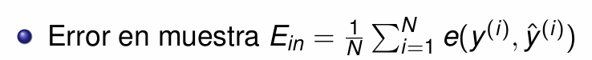
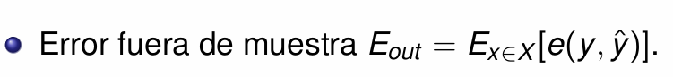
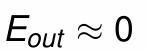
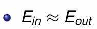
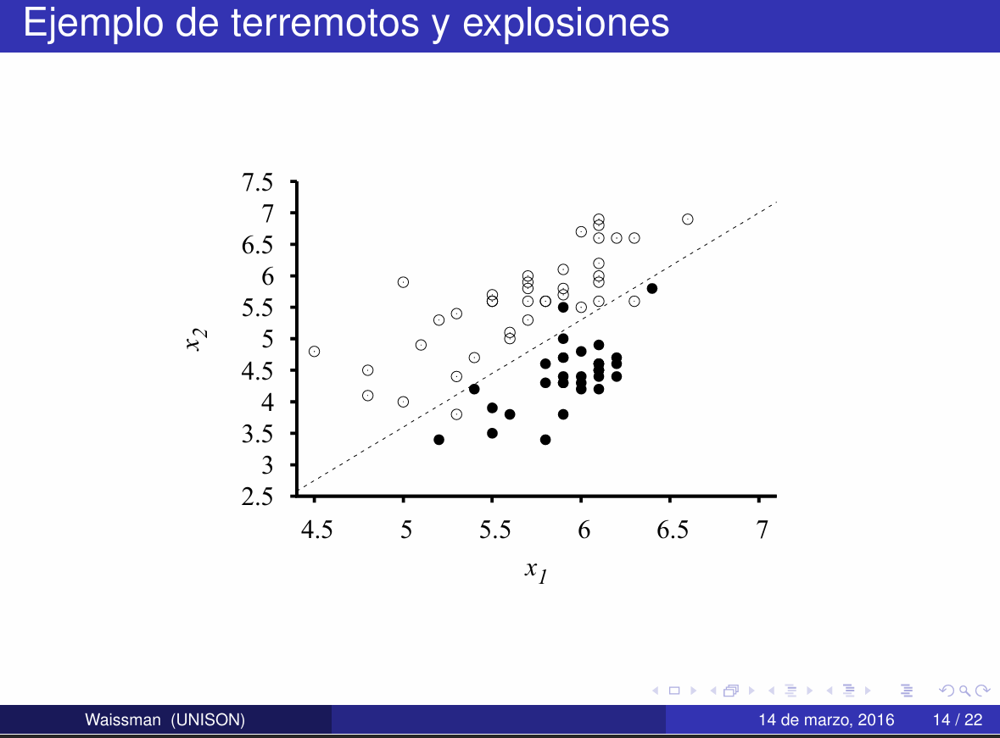
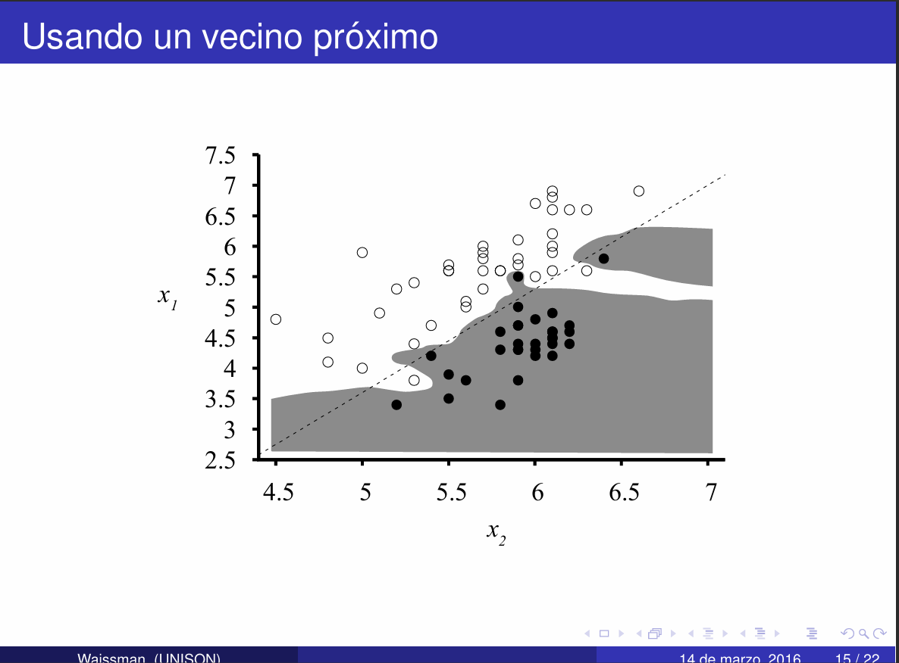
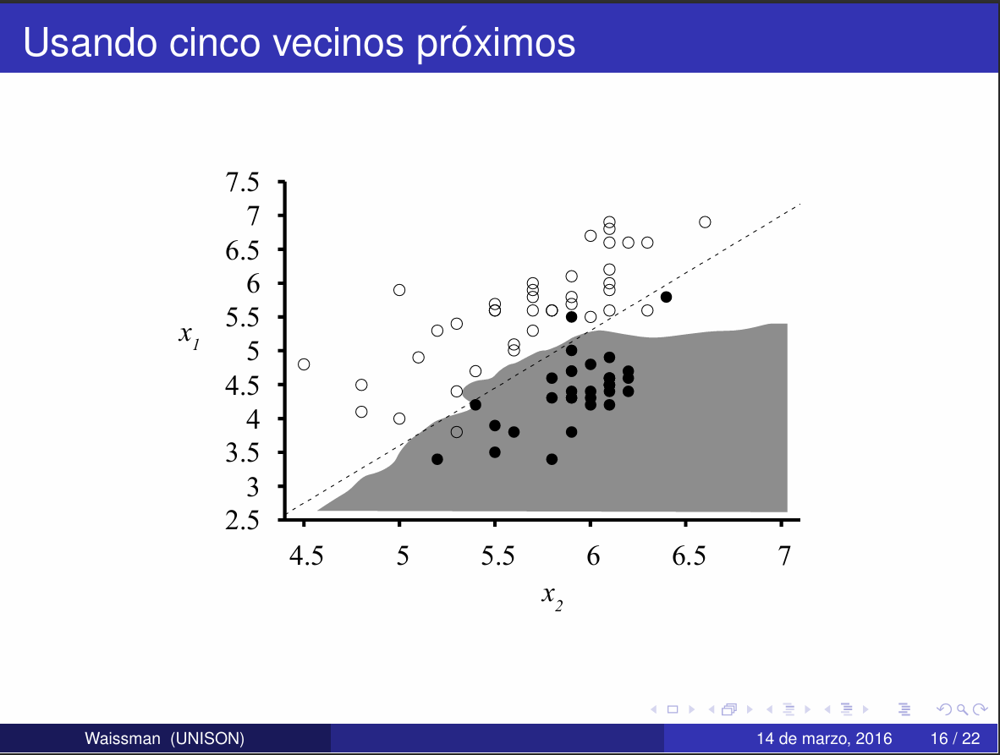
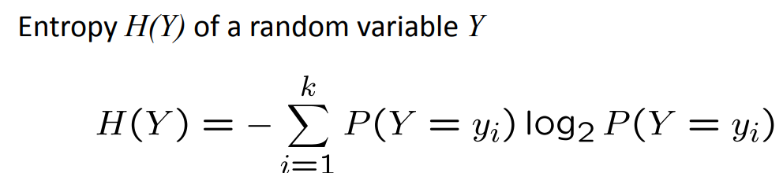
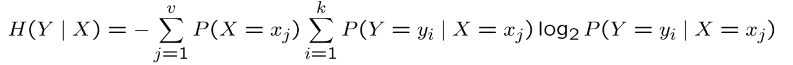
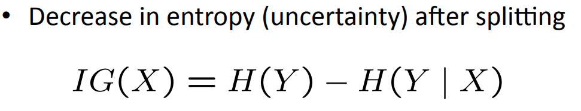

# Notas de la semana de IA
> semana 2

## **Machine Lerning** 
La idea principal de machine learning es permitir que las computadoras aprendan de datos sin la necesidad de ser programada explicitamente para cada tarea especifica 

> Field of study that gives computers the ability to learn without being explicitly programmed." - A. Samuel (1959)

### Motivación
Es muy dificil escribir programas que resuelven problemas complejos, esta es la motivación detras del machine learning, un ejemplo de problema complejo seria reconocer objetos en 3 dimensiones desde una perspectiva diferente y con condiciones de luz diferente 

No podemos escribir el programa porque no sabemos como procesa nuestro cerebro esa información, e incluso si lo supieramos escribir el programa seria horrible 

### Generalización
Es la abilidad de un modelo para hacer predicciones sobre nuevos datos,
es un factor muy importante para el exito de los algoritmos de machine learning 

### Error en muestra 

> Son los datos que usamos para entrenar

### Error fuera de muestra

> Son los datos que quedan fuera de nuestro entrenamiento 

Podemos decir que el aprendizaje existe si y solo si 

> No podemos saber esta informacion

Esto es posible si 

## Metodo del vecino mas proximo kNN
Es un algoritmo de aprendizaje automatico que se usa para hacer predicciones 
o clasificaciones, es un metodo no parametrico, este metodo requiere guardar
todos los datos del conjunto de entrenamiento, se calcula una medida de 
similaridad del dato desconocidocon todos los datos del conjunto de entrenamiento, se selecciona la clase del dato mas cercano

> No hay metodo mas simple conceptualmente 

## Metodos de aprendizaje maquina
+ Modelos descriptivos
+ Modelos lineales generalizados 
+ Arboles de decisión
+ Redes neuronales
+ Metodos de ensamble

## Diimension vc 
Es una medida de la capacidad de los algoritmos de clasificacion estadistica, definida como la 
cardinalidad del mayor conjunto de puntos que el algoritmo puede separar

***Para que el aprendizaje exista se requiere una gran cantidad de datos***
**¿Cuantos datos?** se necesitan minimo 10 veces la dimension vc, si la dimension vc es 10 son necesarios 100 datos

# Arboles de decisón
Es un algoritmo de aprendizaje supervisado no parametrico que se utiliza para tareas de clasificacion o 
regresion, tiene una estructura de arbol jerarquica, que consta de un nodo raiz, ramas, nodos internos y nodos
hoja

Cada nodo interno prueba un atributo xi

Una rama para cada posible valor del atributo xi = v

Cada hoja asigna una clase y 

Para clasificar una entrada x se recorre el arbol desde la raiz hasta una hoja, y la salida y 

**Que funciones puede representar?**
Los arboles de desicion pueden representar cualquier funcion de los atributos
para funciones booleanas el camino a las hojas da la fila de la tabla de verdad

Aprender el arbol de desicion mas simple es un problema NP-completo 
+ empieza con un arbol vacio
+ Separa en el mejor atributo siguiente 
+ recursividad 

**¿Como escoger el mejor atributo para separar?**
usamos *entropia*, la entropia es una medida de desorden de un nodo en un arbol de decision

> Mas incertidumbre mas entropia 

una entropia alta: 
+ Y es de una distribucion uniforme 
+ histograma plano 
+ Los valores muestreados son menos predecibles

Una baja entropia: 
+ Y es de una distribucion variada 
+ Histograma tiene muchos altos y bajos 
+ valores muestreados son predecibles

**entropia Condicional** 

Otra forma de escoger la separacion es **Ganancia de Informacion** 

si la ganancia de informacion es mayor que 0 entonces preferimos esa separacion

Con toda esta informacion entonces el arbol de desición quedaria asi:
+ Empezamos con un arbol vacio
+ separamos con el mejor atributo 
    + usando ganancia de informacion seleccionamos el mejor atributo para separar
+ recursividad

**¿Cuando paramos de separar el arbol?** 
uno de los criterio de paro es si todos los valores
tienen el mimso resultado de salida 

Otro criterio de paro es si los datos tienen el mismo atributo de entrada

### Sesgo cognitivo
Esencia del apredizaje automatico
+ patron
+ No es posible establecerlo de forma analitica (no poder hacerlo de otra forma)
+ Tenemos datos, o los podemos generar

Consideraciones:
+ El AA esta permeando muchas actividades profesionales. No sustituye al conocimiento experto

+ Existe un riesgo de reducción de trabajos no especializados con el uso de AA

+ El AA depende de la evidencia, las evidencias pueden tener        *sesgos*

+ Existe un riesgo latente en el uso de AA en aplicaciones no eticas

